# Three-Tier Project Deployment on AWS (Student Registration Form)

##  Overview
I deployed a **3-Tier Student Registration Web Application** on AWS using a complete **VPC** setup with **NGINX** as a reverse proxy, **Tomcat** as the application server, and **MariaDB on RDS** as the database layer.
- The architecture is divided into three layers:
    1. **Presentation Layer** – Proxy Server (Public Subnet)
    2. **Application Layer** – App Server (Private Subnet-1)
    3. **Database Layer** – RDS & DB Server (Private Subnet-2)
- It ensures **high availability**, **security**, and **scalability** by distributing components across multiple availability zones and using appropriate networking configurations.

---

## Three-Tier Architecture
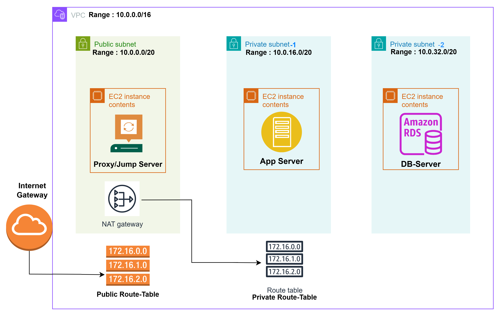
- The **public subnet** only hosts the proxy (exposed to the internet).  
- The **app and DB subnets** remain private for security.  
- A **NAT Gateway** allows private EC2s to download updates without public exposure.
  
 ### 1. Presentation Tier (Proxy Layer)
   - Hosted in a public subnet
   - Uses NGINX as a reverse proxy
   - Handles all incoming HTTP traffic
   - Also works as a Jump Server (Bastion Host) to connect securely to private instances

 ### 2. Application Tier (Private Subnet)
   - Runs Apache Tomcat
   - Hosts the Java-based Student Registration Web Application
   - Connects to the database through JDBC

 ###  3. Database Tier (Private Subnet)
   - Uses Amazon RDS (MariaDB)
   - Stores student registration data
   - Only accessible from the Application Tier (port 3306)”
---

# Steps to deploy the Student Application Form :
## 1. Create the VPC
1. Create VPC:
   - Name: **three-tier-VPC**
   - CIDR: `10.0.0.0/16`
```bash
 # The VPC defines your isolated network in AWS. 
 # The `/16` block provides enough IPs to subdivide into multiple subnets.
 # (Optional) Tag the VPC so you can filter easily in the console.
``` 
   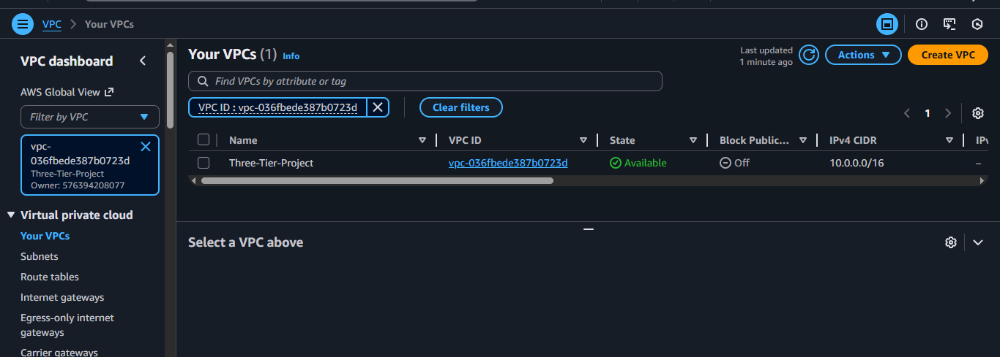
---

## 2️. Create subnets (different AZs for High Availability)

 1.  **public-subnet**
      - CIDR: `10.0.0.0/20`
      - AZ: **us-east-1a**
      - Enable auto-assign public IPv4 if you want EC2 with public IP.

 2.  **private-subnet-1**
     - CIDR: `10.0.16.0/20`
     - AZ: **us-east-1b**

 3. **private-subnet-2**
     - CIDR: `10.0.32.0/20`
     - AZ: **us-east-1c**
 ```bash 
 #  Public subnet : hosts internet-facing resources (proxy, NAT).  
 # Private subnets : isolate app and DB tiers for security and compliance. 
```
   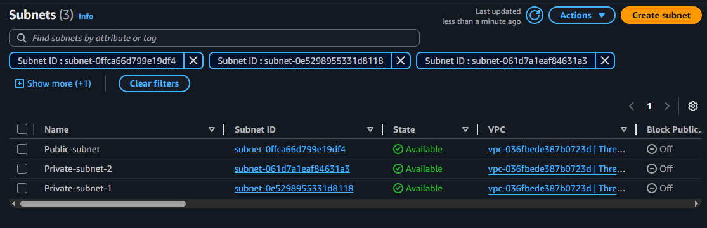
 - Ensure different AZs are used for high availability.
 - Ensure each private subnet is associated with the private route table later.

---

## 3. Internet Gateway (IGW) + Public Route Table
1. Create an Internet Gateway:
   - Name: **three-tier-IGW**
   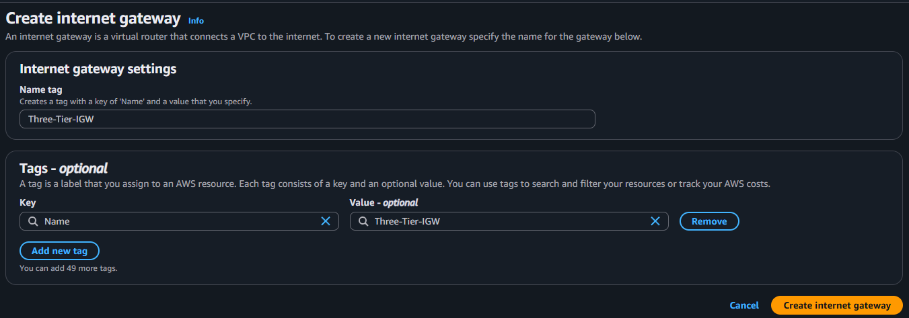
   - Attach it to **three-tier-VPC**.
```bash 
 # Enables public subnets to access the Internet.
```

2. Create / or edit Route Table for public traffic:
   - Rename route table to **public-RT** (or create new).
   - Edit routes: add `0.0.0.0/0` → target **three-tier-IGW**.
   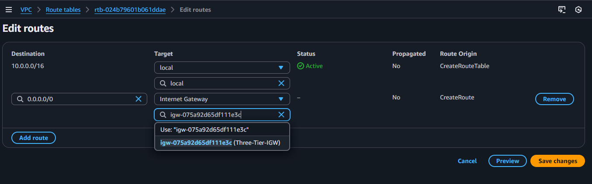
   - **(Optional)** Subnet association: associate **public-RT** with **public-subnet**.
 ```bash 
 # Public-RT → route `0.0.0.0/0` → IGW → associate with `public-subnet`.  
```
---

## 4. NAT Gateway + Private Route Table
1. Create a private route table:
   - Name: **private-RT**
   - Associate **private-RT** with **private-subnet-1** and **private-subnet-2**.
   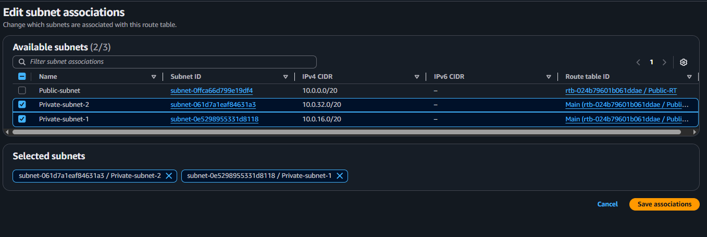
 ```bash
 # Private-RT → route `0.0.0.0/0` → NAT Gateway → associate with private subnets.
```
2. Create NAT Gateway:
   - Name: **three-tier-NAT**
   - Subnet: **public-subnet**
   - Allocate an **Elastic IP** for it.
   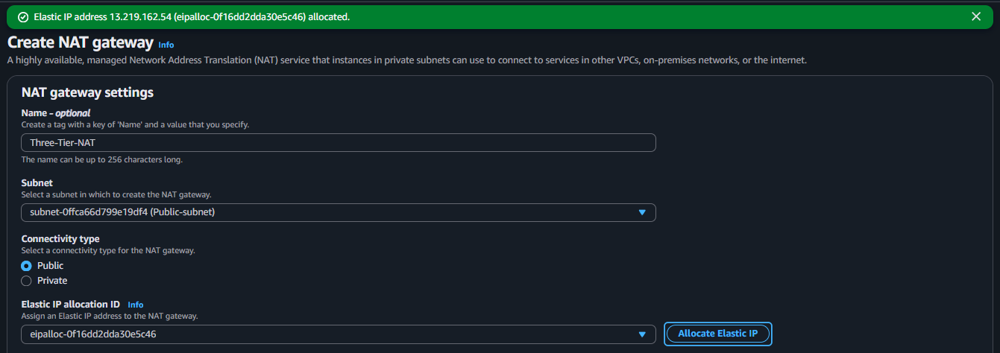
 ```bash
 # Lets private EC2s download updates or dependencies from the internet securely.
  ```
3. Edit **private-RT** routes:
   - Add `0.0.0.0/0` → target **three-tier-NAT**.
 ```bash
 # This allows instances in private subnets to access the Internet for updates/patches without public IPs.
```
---


## 5. Security Group (three-tier-SG)

- **Name:** `three-tier-SG`
- **Description:** Allow SSH, HTTP, MySQL, and custom TCP (8080)
- **VPC:** `three-tier-VPC`

 - **Inbound Rules:**
    - SSH: Anywhere (IPv4)
    - HTTP: Anywhere (IPv4)
    - MySQL/Aurora: Custom TCP 3306
    - Custom TCP: 8080
 ```bash
 # Security groups act as  firewalls controlling inbound/outbound traffic.
 ```
 ---

## 6. Launch Instances
### 6.1 Proxy Server (public)
- **Name:** Proxy Server
- **AMI:** Amazon Linux 2 (A1)
- **VPC:** three-tier-VPC  
- **Subnet:** public-subnet  
- **SG:** three-tier-SG

### 6.2 App Server (private)
- **Name:** App Server
- **AMI:** Amazon Linux 2 (A1)
- **VPC:** three-tier-VPC 
- **Subnet:** private-subnet-1  
- **SG:** three-tier-SG

### 6.3 DB Server (private)
- **Name:** DB Server
- **AMI:** Amazon Linux 2 (A1)
- **VPC:** three-tier-VPC
- **Subnet:** private-subnet-2  
- **SG:** three-tier-SG
  

---

## 7. RDS MariaDB (managed DB)
1. Create DB instance:
   - **Type:** Standard Create  
   - **Engine:** MariaDB 
   - **DB Identifier:** `three-tier-RDS` 
   - **Authentication:** Auto-generate password (store securely)
   - **VPC:** `three-tier-VPC`
   - **Security Group:** `three-tier-SG` 
   - **Availability Zone:** `us-east-1c` (or use Multi-AZ for higher availability)

2. Note the **RDS endpoint and saved password** — you'll use this in the app **DB config**.
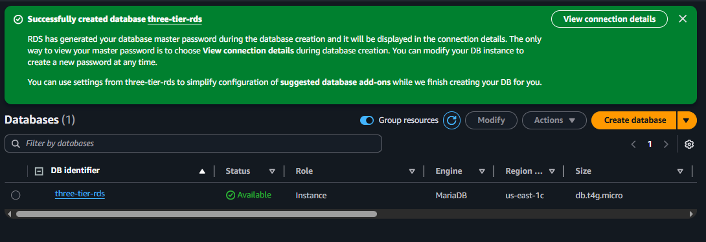
```bash
 # RDS can replace the DB EC2 instance for managed performance and backups.
```
---

## 8. SSH & Setup Proxy Server (nginx)
 - SSH in (from your workstation)
```bash
ssh -i <key.pem> ec2-user@<proxy-public-ip> 
sudo  hostnamectl hostname proxy 
exit

# SSH :Connect to the public EC2 using your SSH key. 
# hostnamectl : sets a logical name for the host.
```
   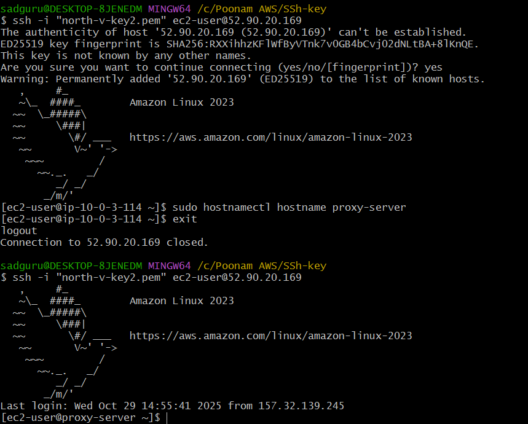
 - Update and Install Nginx:
```bash
sudo yum update 
sudo yum install nginx -y
sudo systemctl start nginx
sudo systemctl enable nginx

# yum update : ensures system packages are current.  
# systemctl : starts and auto-enables NGINX at boot.
```
- ### Edit nginx config to proxy to app server
   - Open the nginx config (or site conf):
```bash
         cd /etc/nginx/
         sudo vim nginx.conf
```
   - Add inside server block:
```bash
         location / {
         proxy_pass http://<app-server-private-ip>:8080/student/;
         }
 # NGINX forwards external HTTP traffic to the private app server’s internal IP on port 8080.
```
   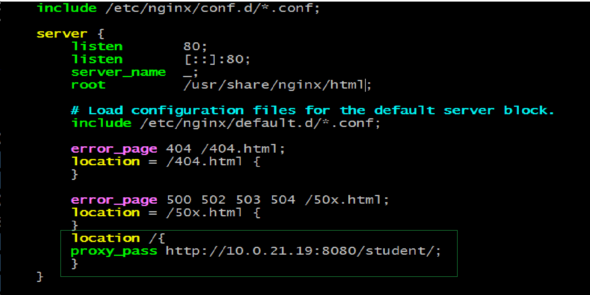
   - Restart Nginx:
```bash
         sudo systemctl restart nginx
```
---

## 9. Transfer private key to proxy (if you plan to SSH into app via proxy)
- From your local machine:
```bash
   scp -i <key.pem> <key.pem> ec2-user@<proxy-public-ip>:/home/ec2-user/
 # Transfers key to proxy for secure access into private EC2 via bastion model.
```
   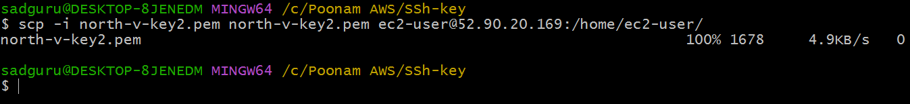
---

## 10. SSH to App Server (via proxy or using SSM)
 - From proxy (if using private key on proxy):

         sudo ssh -i <key.pem> ec2-user@<app-server-private-ip>
         sudo hostnamectl hostname app-server
         exit
   
 - SSH again to app-server :
---

## 11. Install Java and Tomcat on App Server
 - Install Java
```bash
    sudo yum update -y
    sudo yum install java -y
    java -version
 # `yum install java` installs the JRE runtime for Tomcat.  
```
 -  Download and extract Tomcat (example using curl)
       1. On Tomcat website pick the `apache-tomcat-9.x` core tar.gz and copy its link.
       2. On the app server:
```bash
         cd /opt
         sudo wget <tomcat-core-tar.gz-link>
         sudo tar -xvzf apache-tomcat-9.x.xx.tar.gz -C /opt/ 
 # `curl` downloads the Tomcat package. 
 ```
   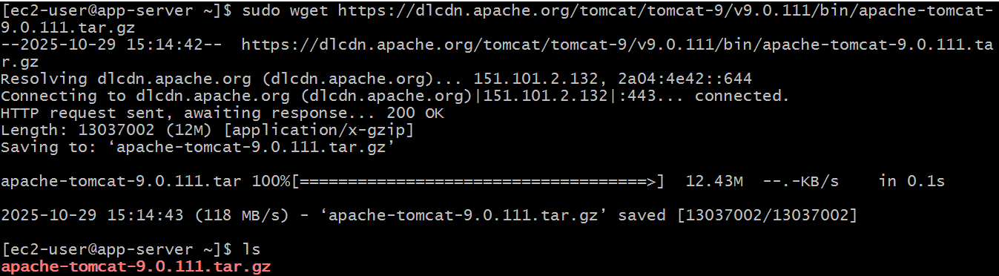
   
 -  Start Tomcat
```bash
      cd /opt/<apache-tomcat-folder>/bin
      ./catalina.sh start
 # `catalina.sh start` launches the Tomcat service.
```
---

## 12. Deploy Student Application
- On the app server:

         cd /opt/<apache-tomcat-folder>/webapps/
         
 -  **download the WAR provided by your source (e.g., from a PDF link or artifact storage)**
         
         wget <link-to-studentapp.war>
      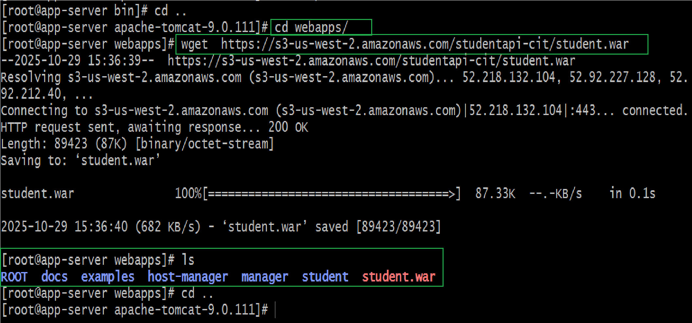
 - ### restart Tomcat to pick up the WAR

         cd ../bin/
         ./catalina.sh stop
         ./catalina.sh start

 - After Tomcat starts, app should be available on port `8080` (internally).
- Restart Nginx:

         sudo systemctl restart nginx
---

### Paste the public ip of proxy-server on the Google
---

## 13.Database Setup
 - SSH to DB Server and change the hostname:
 ```bash 
  sudo ssh -i <key.pem> ec2-user@<private-IP of db-server>
  sudo hostnamectl hostname db
  exit
 ```
 - Login again to db-server:
 ```bash 
  sudo yum update -y
  sudo yum install mariadb105-server -y
  sudo systemctl start mariadb
 # Installs and starts MariaDB locally, or connects to RDS via client.
 ```
 ---

## 14. Configure DB (if using RDS)
- From the **DB server** (or from an EC2 in same VPC with mysql client):
```bash
# if you installed mariadb client
mysql -h <RDS-endpoint> -u admin -p
# enter RDS password when prompted
```

- SQL to create DB and table:
```sql
CREATE DATABASE studentapp;
USE studentapp;

CREATE TABLE IF NOT EXISTS students (
    student_id INT NOT NULL AUTO_INCREMENT,
    student_name VARCHAR(100) NOT NULL,
    student_addr VARCHAR(100) NOT NULL,
    student_age VARCHAR(3) NOT NULL,
    student_qual VARCHAR(20) NOT NULL,
    student_percent VARCHAR(10) NOT NULL,
    student_year_passed VARCHAR(10) NOT NULL,
    PRIMARY KEY (student_id)
);

SHOW TABLES;
SELECT * FROM students;
exit
```
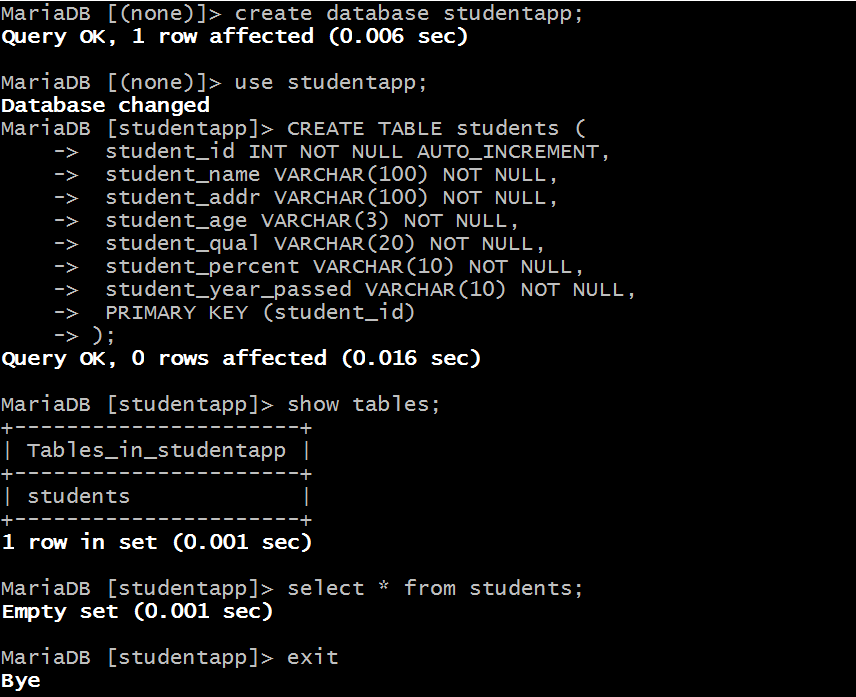
 ```bash
 # Initializes schema for the web app to store student records
   ```
---

## 15. Add MySQL connector to Tomcat (app → RDS)
- On app server:
 ```bash
sudo -i 
cd /opt/<apache-tomcat-folder>/lib/
ls

# download connector
curl -O <mysql-connector-link>
 ls
 # The connector JAR provides JDBC connectivity, and the datasource config enables Tomcat to pool DB connections securely.
 ```

- Edit Tomcat `context.xml` to add resource:
```xml
# /opt/<apache-tomcat-folder>/conf/context.xml
<Context>
  ...
            <Resource name="jdbc/TestDB" auth="Container" type="javax.sql.DataSource"
                      maxTotal="500" maxIdle="30" maxWaitMillis="1000"
                      username="admin" password="<your-rds-password>"
                      driverClassName="com.mysql.jdbc.Driver"
                      url="jdbc:mysql://<RDS-ENDPOINT>:3306/studentapp?useUnicode
                      =yes&amp;characterEncoding=utf8"/>
  ...
</Context>
```
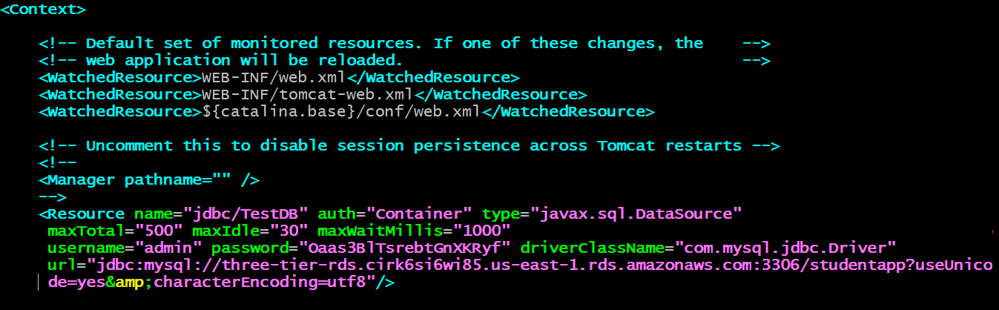

- Restart Tomcat:
```bash
cd /opt/<apache-tomcat-folder>/bin/
./catalina.sh stop
./catalina.sh start
```

---

## Verification
1. Visit the **Proxy Public IP** in a browser: `http://<proxy-public-ip>/`  
 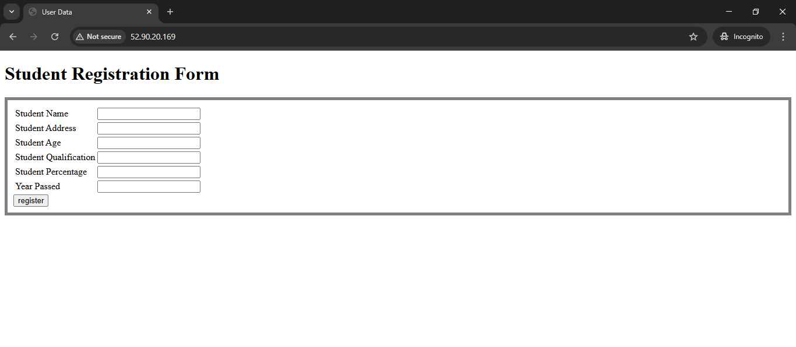
   - Nginx proxies requests to `http://<app-private-ip>:8080/student`
  
2. Fill in the student data form.

   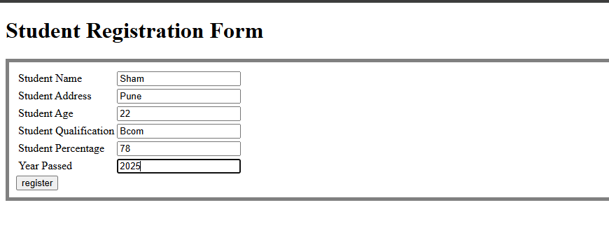

3. Verify data is saved successfully.
   
   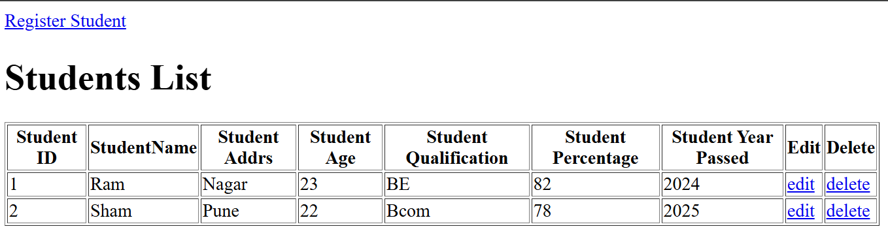

4. Connect to RDS or DB Server:
```sql
USE studentapp;
SELECT * FROM students;
```
 - You should see the inserted records.
 - 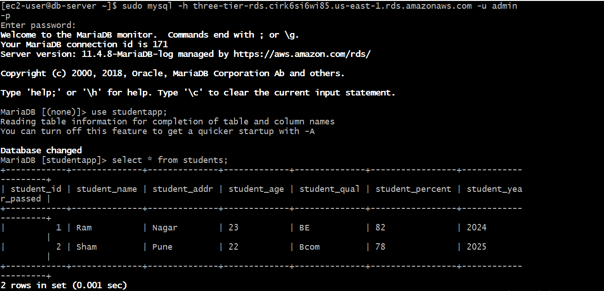
---

## Troubleshooting tips
- If the app is not reachable, check:
  - Security group inbound rules (ports open correctly).
  - NACLs on subnets (should allow traffic).
  - Route tables (public subnet routes to IGW, private to NAT).
  - Tomcat status and logs (`catalina.out`).
  - Nginx error logs (`/var/log/nginx/error.log`).
  - RDS inbound rule allows app SG to connect on 3306.

---

## Conclusion

- This project successfully sets up a Three-Tier Web Application on AWS, complete with:
     - Secure networking (VPC, subnets, routing)
     - Scalable compute (EC2)
     - Managed database (RDS)
     - Load separation (proxy → app → DB)
- It demonstrates fundamental AWS networking, EC2 configuration, and integration between compute and database layers in a real-world  architecture.